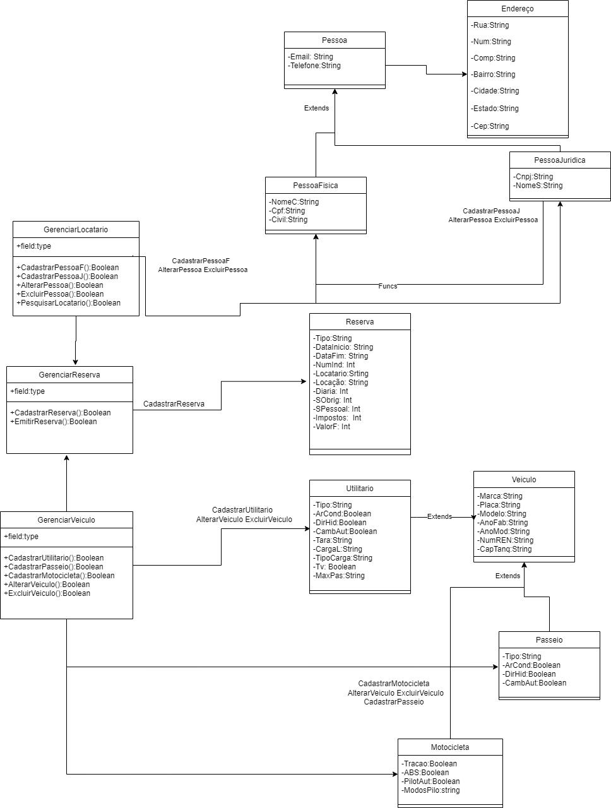

# projeto-tppe

Sistema de Gerenciamento de Locatarios de Carros. 


---

<br>

## Diagrama de Classes do Projeto

<div align='center'>
<p>Diagrama UML de Classes:</p>
<a href="docs/assets/DiagramaClassesTPPE.png"></img></a>
</div>

## Backlog do Projeto

 [Backlog do Projeto](https://github.com/users/CaioSulz/projects/1) 

---

## Requisitos para executar o projeto

- [Docker](https://www.docker.com/)
- [Docker Compose](https://docs.docker.com/compose/)

---

## Como executar o projeto

1. **Clone o repositório**
   ```bash
   git clone https://github.com/CaioSulz/projeto-tppe.git

2. **Build dos containers**

    ```bash
    docker-compose up --build

3. **Acesse a aplicação:**

*  http://localhost:8080

## Como executar os testes e o linter

1. **Execute os testes:**
   ```bash
   make docker-test

2. **Execute o linter:**
   ```bash
   make docker-lint